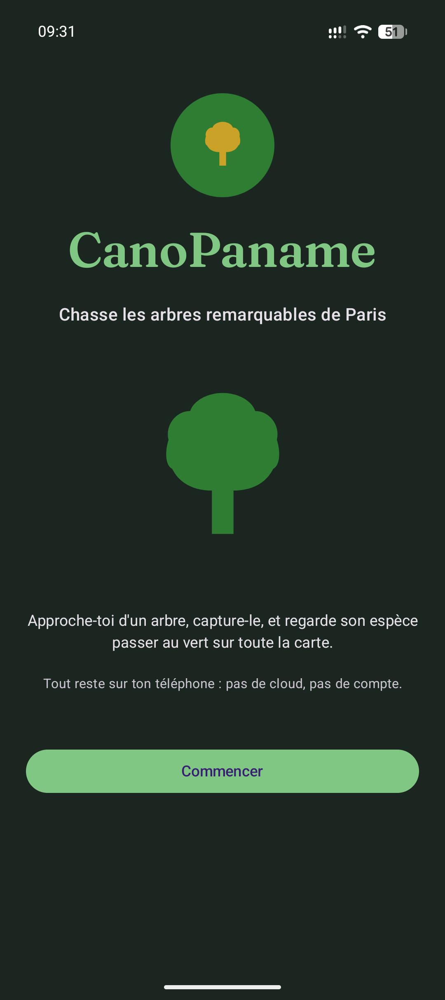
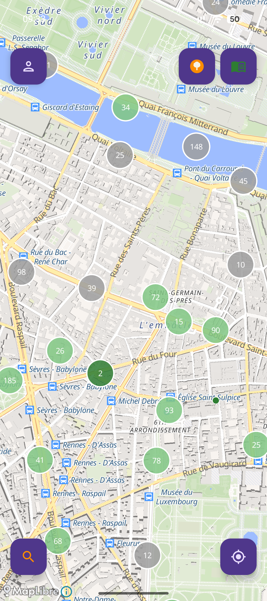
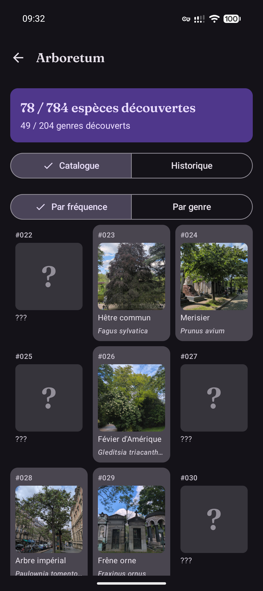
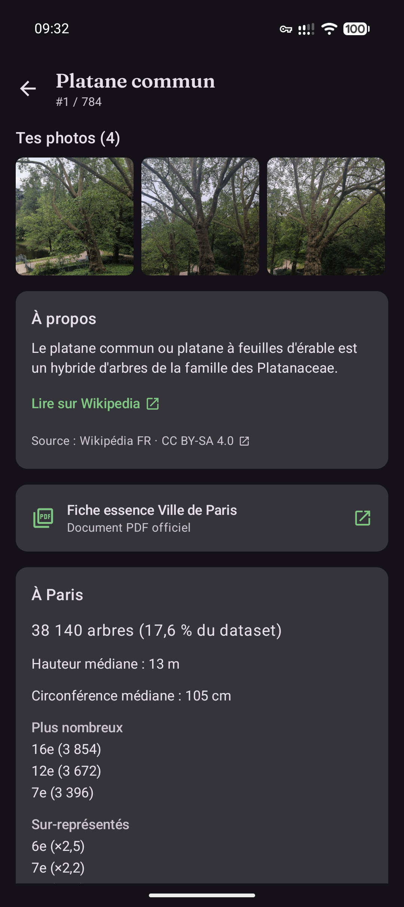
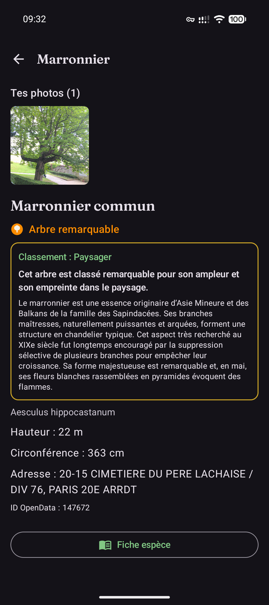
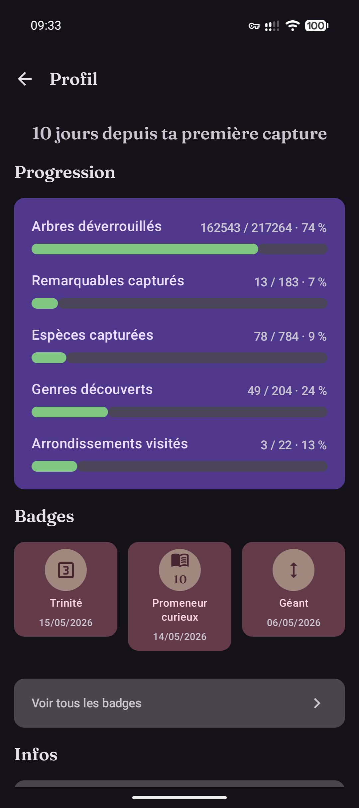

# CanoPaname

> Pokédex botanique des arbres de Paris. App Android, single-player, 100 % local.

App Android pour partir à la chasse aux arbres remarquables de Paris, collectionner les espèces, et redécouvrir la ville par sa canopée. Inspirée de Pokémon GO et Space Invaders, mais avec de **vrais** arbres : ceux du dataset [OpenData Paris « les-arbres »](https://opendata.paris.fr/explore/dataset/les-arbres/) (217 960 arbres géolocalisés, dont 183 « remarquables »).

> **Statut** : v1.3.2 (hotfix reproductibilité du build release + refresh dataset). Usage personnel + family & friends. Repo public pour transparence et Obtainium ; pas de PR externe acceptée à ce stade.

  
  
  
  
  
  

## Ce que c'est

217 960 arbres parisiens géolocalisés sur une carte plein écran, 778 espèces identifiées, 204 genres, 183 arbres remarquables à dénicher. Capture par proximité (< 30 m) avec une photo prise depuis l'app. La carte se colore au fil de tes découvertes. Mode chasse ★ pour pister le remarquable le plus proche, Catalogue à 2 niveaux *Catalogue* / *Historique*, fiches genre, badges (dont familles « Familier » par genre et par arrondissement), suivi de progression sur le Profil, export ZIP. Pensé family & friends, pas de classement, pas de social.

## Pourquoi

- Les arbres sont déjà là, déjà géolocalisés, déjà documentés (espèce, hauteur, circonférence, date de plantation, statut remarquable).
- Pas besoin de licence IP, pas besoin de serveur de spawning, pas besoin de Google Play Services.

## Installation (Android 8.0+)

- **Via Obtainium** (recommandé) : ajouter ce repo `https://github.com/m4xim1nus/CanoPaname` dans Obtainium, source « GitHub ». Mises à jour automatiques aux nouveaux tags.
- **APK direct** : [dernière release](https://github.com/m4xim1nus/CanoPaname/releases/latest) → `canopaname-vX.Y.Z-release.apk`.
- **Vérifier la signature** : `apksigner verify --print-certs canopaname-vX.Y.Z-release.apk` — fingerprint SHA-256 publié dans la note de chaque Release.

## Permissions

- **Position fine** : mesurer les < 30 m d'un arbre pour autoriser la capture. Jamais envoyée.
- **Caméra** : photographier l'arbre capturé. Photo stockée localement.
- **Vibrer** : retour haptique court à la capture.

## Données et vie privée

Tout reste sur ton téléphone. Pas de cloud, pas de compte, pas de tracker. Tuiles cartographiques OpenStreetMap via OpenFreeMap, sans envoi de données personnelles. Détails dans [PRIVACY.md](PRIVACY.md).

## FAQ

- *Pourquoi pas le Play Store ?* — Pas de Google Play Services requis. GrapheneOS first.
- *Mes captures, je peux les exporter ?* — Profil → Sauvegarde → Exporter (ZIP).
- *Le dataset bouge ?* — Mis à jour aux releases majeures (re-cuit dans l'APK, pas de download au runtime).
- *Pourquoi pas de PR externe ?* — App perso family & friends. Le repo est public pour la transparence et Obtainium ; pour un fix ou une suggestion, ouvre une issue.

## Attributions

- Données arbres : Ville de Paris, OpenData (licence ODbL).
- Cartographie : OpenFreeMap, OpenStreetMap contributors (ODbL).
- Résumés d'espèces : Wikipedia FR (CC BY-SA 4.0).
- Police Fraunces : Undercase Type (OFL 1.1).
- Bibliothèques : MapLibre (BSD-2), Compose / Material 3 / AndroidX (Apache 2.0).

Détails complets dans [NOTICE.md](NOTICE.md).

## Licence

[MIT](LICENSE).

## Développement

Voir [CLAUDE.md](CLAUDE.md) pour la stack, les commandes et les conventions ; [ROADMAP.md](ROADMAP.md) pour l'historique des phases.
